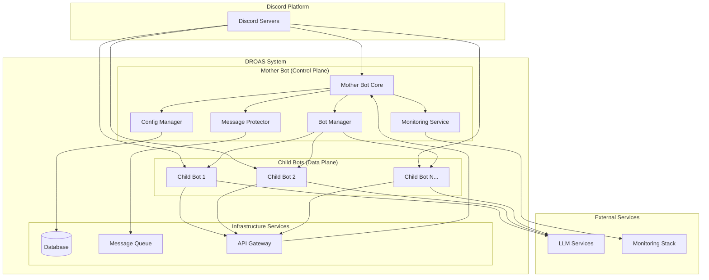

# DROAS Discord Bot System - Architecture Document

## Executive Summary

DROAS Discord Bot System 是一個以 Rust 編寫的高性能、可擴展的 Discord 機器人系統，採用母子機器人架構模式。系統支持最多 10 個子機器人實例，每個子機器人可獨立連接 OpenAI Compatible LLM，並由母機器人提供群組防護、配置管理、監控告警等核心服務。

核心架構原則：
- 分離關注點：母機器人專注管理和防護，子機器人專注業務邏輯
- 彈性與容錯：支援自動故障檢測與恢復
- 高性能：基於 Rust async runtime，支持高並發處理
- 可觀測性：完整的監控、日誌和告警機制

## System Overview

Business Domain: Discord 群組管理與自動化  
Target Users: 群組管理員、Discord 社群運營者  
Key Business Goals: 提供可擴展的多機器人管理平台，自動化群組防護與管理

Architecture Principles:  
- Scalability: 水平擴展子機器人實例，支持更多群組  
- Maintainability: 模組化設計，清晰的責任分離  
- Security: 敏感資訊加密存儲，最小權限原則  
- Performance: 5秒內完成訊息處理，2秒內完成工具調用

## Technical Stack

```yaml
frontend:
  framework: "Dashboard (Optional Future Enhancement)"
  language: "TypeScript"
  styling: "Tailwind CSS"
  
backend:
  framework: "Axum"
  language: "Rust"
  runtime: "Tokio Async Runtime"
  
database:
  primary: "SQLite (Development) / PostgreSQL (Production)"
  cache: "Redis (Optional for tool call caching)"
  
infrastructure:
  cloud_provider: "Generic Cloud VPS"
  container: "Docker"
  ci_cd: "GitHub Actions"
  monitoring: "Prometheus + Grafana"
  
external_services:
  discord_api: "Discord REST API + Gateway"
  llm_services: "OpenAI Compatible APIs"
  notifications: "Discord Webhooks"
```

## System Architecture



## Functional Requirements Architecture

### F-001: 子機器人管理架構

Process Manager Pattern + Supervisor Pattern

核心組件:
- Bot Manager Service: 中央管理服務，負責子機器人的生命週期管理
- Process Supervisor: 監控子機器人進程健康狀態
- Registry Service: 維護活躍子機器人註冊表  
- Health Check Service: 定期檢查子機器人狀態

實作示意:

```rust
pub struct BotManager {
    active_bots: Arc<RwLock<HashMap<BotId, BotInstance>>>,
    supervisor: ProcessSupervisor,
    registry: ServiceRegistry,
}

impl BotManager {
    pub async fn start_bot(&self, config: BotConfig) -> Result<BotId> { todo!("start") }
    pub async fn stop_bot(&self, bot_id: BotId) -> Result<()> { todo!("stop") }
    pub async fn restart_bot(&self, bot_id: BotId) -> Result<()> { todo!("restart") }
    pub async fn health_check(&self, bot_id: BotId) -> HealthStatus { HealthStatus::Healthy }
}
```

### F-002: 群組防護架構

Event-Driven Architecture + Rules Engine Pattern

核心組件:
- Message Inspector Service: 實時訊息內容分析
- Rules Engine: 可配置的防護規則處理器
- Action Executor: 執行防護動作（禁言、刪除等）
- Pattern Recognition Service: 垃圾訊息和洗版行為識別

處理流程:

```
Message Event → Inspector → Rules Engine → Decision → Action Executor → Audit Log
```

### F-003: 配置管理架構  

Configuration as Code + Hot Reload Pattern

核心組件:
- Config Service: 中央配置管理服務
- File Watcher: 監控 YAML 檔案變更
- Validation Engine: 配置語法驗證
- Event Bus: 配置變更事件分發

配置範例:

```yaml
bot_config:
  discord_token: "${CHILD_BOT_01_TOKEN}"
  llm_config:
    base_url: "${LLM_BASE_URL}"
    api_key: "${LLM_API_KEY}"
  system_prompt: "You are a helpful assistant..."
  protection_level: "medium"
```

### F-004: 工具調用系統架構

API Gateway Pattern + Message Queue Pattern

核心組件:
- Internal API Gateway: 母子機器人間的通信閘道
- Service Registry: 服務發現機制  
- Request/Response Queue: 異步訊息佇列
- Authorization Service: 權限控制和審核

介面示意:

```rust
#[async_trait]
pub trait ToolCallService {
    async fn call_economy_service(&self, request: EconomyRequest) -> Result<EconomyResponse>;
    async fn call_user_service(&self, request: UserRequest) -> Result<UserResponse>;
    async fn audit_call(&self, call_id: CallId, result: CallResult);
}
```

### F-005: 監控與告警架構

Observability Pattern + Metrics Collection

核心組件:
- Metrics Collector: 系統指標收集器
- Log Aggregator: 結構化日誌聚合
- Alert Manager: 告警條件評估和通知
- Dashboard Service: 監控儀表板

指標：
- 訊息處理量 (messages/second)
- 錯誤率 (error_rate)
- API 調用次數 (api_calls_total)
- 響應時間分位數 (response_time_p95)

## Non-functional Requirements Architecture

### 性能架構 (Performance Architecture)

```yaml
message_processing:
  target_latency: "< 5 seconds (p95)"
  throughput: "數條消息/分鐘 per group"
  
tool_calls:
  target_latency: "< 2 seconds (p95)"
  concurrency: "支持並發調用"

optimization_techniques:
  - "Rust async runtime with tokio"
  - "Connection pooling for HTTP clients"
  - "Bounded channels for backpressure control"
  - "Local caching for frequent metadata"
```

### 可用性架構 (Availability Architecture)

```yaml
uptime_target: "99% annually"

fault_tolerance:
  supervisor_pattern: "Auto-restart failed child bots"
  health_checks: "Periodic liveness/readiness checks"
  graceful_shutdown: "SIGTERM handling with cleanup"
  
monitoring:
  health_endpoints: "/health, /ready"
  alerting: "Discord webhook notifications"
  recovery_time: "< 30 seconds for bot restart"
```

### 安全性架構 (Security Architecture)

```yaml
secrets_management:
  injection_method: "Environment variables only"
  storage_encryption: "SOPS/age for config files"
  log_redaction: "Automatic PII/token masking"
  
access_control:
  principle: "Least privilege"
  api_permissions: "Scoped bot tokens"
  audit_logging: "All sensitive operations logged"
```

### 可觀測性架構 (Observability Architecture)  

```yaml
structured_logging:
  format: "JSON with trace_id"
  levels: ["DEBUG", "INFO", "WARN", "ERROR"]
  
metrics:
  system: "Prometheus format"
  custom: ["message_count", "error_rate", "api_calls"]
  
alerting:
  triggers: ["API quota exhaustion", "consecutive errors", "connection failures"]
  channels: ["Discord webhooks", "Email notifications"]
```

## 部署架構 (Deployment Architecture)

```yaml
infrastructure:
  environment: "Single production environment"
  resources: "2 CPU cores, 4GB RAM"
  platform: "Docker containers on cloud VPS"
  
orchestration:
  service_management: "systemd or docker-compose"
  startup_time: "< 30 seconds cold start"
  
ci_cd:
  pipeline: "GitHub Actions"
  deployment: "Automated with health checks"
```

## 風險評估 (Risk Assessment)

- Discord API rate limiting → 指數退避與佇列管理
- LLM 服務不可用 → 多供應商與降級策略

## 實施路線圖 (Implementation Roadmap)

- Phase 1: 基礎架構（4-6週）
- Phase 2: 核心功能（6-8週）
- Phase 3: 性能與安全（4-6週）
- Phase 4: 生產就緒（2-4週）

