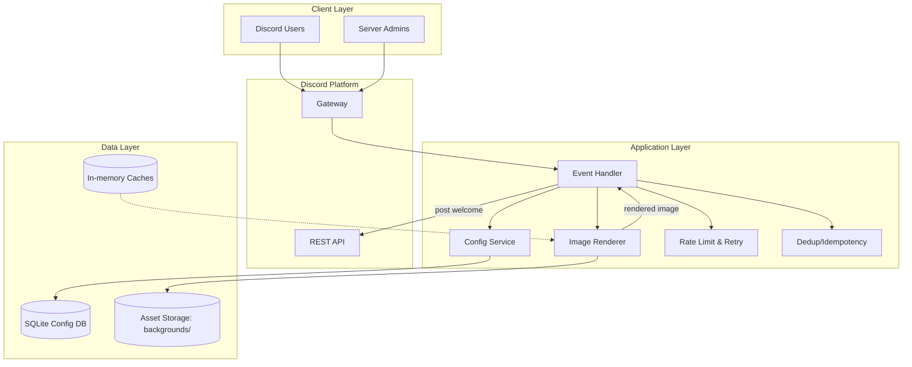

---
project-metadata:
  project-name: "discord-welcome-bot"
  version: "1.0.0"
  author: "Architecture Team"
  date-created: "2025-09-16"
  last-updated: "2025-09-16"
  status: "Draft"
---

## Executive summary
This project delivers a Discord bot (implemented in Rust) that welcomes new members in a guild by posting a message and attaching a personalized welcome image. The bot supports per-guild configuration (welcome channel and background image), resilient event handling, and rate-limit-aware interactions with Discord APIs. The architecture emphasizes simplicity for the MVP (local or free-tier storage), low operational cost, and clear pathways to scale.

## System overview
### Project context
- business-domain: community onboarding and branding within Discord guilds
- target-users: server administrators and moderators
- key-business-goals: improve onboarding experience, reinforce server identity, and reduce manual moderator workload

### Architecture principles
- scalability: event-driven processing with backoff and idempotency; lightweight horizontal scaling feasible later
- maintainability: modular services (event handling, image rendering, configuration); clean boundaries and contracts
- security: least-privilege intents/permissions; strict secret handling; never log sensitive tokens
- performance: image rendering optimized for p95 targets; async IO and backoff for API calls

## Technical stack
### Frontend
- framework: N/A (no end-user web UI; Discord client apps act as the presentation layer)
- language: N/A
- styling: N/A

### Backend
- framework: Rust application using serenity (Discord API v10)
- language: Rust (stable)
- runtime: native binary

### Database
- primary: PostgreSQL for per-guild configuration
- cache: in-memory caches (fonts, background metadata)
- search: N/A

### Infrastructure
- cloud-provider: none required for MVP (local or low-cost host)
- container: optional Docker image for deployment; not required for local dev
- ci-cd: GitHub Actions (lint, test, build)
- monitoring: basic logs; optional future integration with a log aggregator

### External services
- authentication: bot token (Discord)
- payment: N/A
- notifications: Discord channels via bot messages

## System architecture
### Architecture diagram

## Functional requirements architecture
### Authentication system
- components:
  - bot-token-management
  - permission-intents (minimal required)
  - secure-config-loader (env var)
- design-pattern: token-based app authentication (Discord bot)
- security-measures:
  - secret-from-env only; no token in source or logs
  - least-privilege intents
  - rotate tokens if compromise suspected
- data-flow:
  - process-startup -> read $DISCORD_BOT_TOKEN -> connect gateway -> handle events

### Data processing pipeline
- components:
  - join-event-ingestion
  - rendering-pipeline (avatar fetch, composition, text overlay)
  - output-delivery (message + attachment)
- design-pattern: event-driven pipeline
- scalability-approach:
  - exponential backoff on transient failures
  - rate-limit-aware client (respect retry-after)
  - optional batching for previews in the future

### API endpoints
- design-pattern: Discord application commands and gateway events (no public HTTP API)
- endpoints:
  - slash-commands: /set-background, /preview
  - events: GUILD_MEMBER_ADD
- documentation: inline command help and repository docs
- versioning-strategy: semantic versioning for bot releases

## Non-functional requirements architecture
### Performance
- response-time: <= 3000ms for posting on member join (P95)
- throughput: up to 30 join events/min across ~100 guilds (MVP target)
- scalability-strategy:
  - non-blocking IO and bounded retries
  - cache fonts and reuse buffers
  - prefetch/cached avatars where feasible
- optimization-techniques:
  - image pipeline reuse and buffer pooling
  - minimize network calls; respect ETag/If-Modified-Since if available

### Security
- authentication:
  - method: Discord bot token from environment variable
  - password-policy: N/A
  - session-management: N/A (stateless gateway/HTTP interactions)
- authorization:
  - model: permission checks for admin-only commands (Manage Guild)
  - permissions: scoped per guild; minimal intents
- data-protection:
  - encryption-at-rest: host/disk-level (as available)
  - encryption-in-transit: TLS between bot and Discord
  - data-anonymization: avoid storing PII beyond guild IDs and config
- vulnerability-protection:
  - input-validation: strict URL/attachment validation for background
- sql-injection: parameterized queries for PostgreSQL
  - xss-protection: N/A (no web UI)
  - csrf-protection: N/A (no web UI)

### Availability
- uptime-target: 99.5% (MVP)
- disaster-recovery:
- backup-strategy: periodic backup of PostgreSQL database and assets
  - recovery-time-objective: < 4 hours
  - recovery-point-objective: < 1 hour
- monitoring:
  - health-checks: process heartbeat, reconnect-on-disconnect
  - alerting: basic logs; future: integrate simple alerts
  - logging: structured logs to stdout
- fault-tolerance:
  - redundancy: single instance (MVP); future multi-instance with queue
  - failover: process supervisor auto-restart
  - circuit-breaker: backoff and retry around Discord APIs

## Data architecture
### Data model
- entities:
  - guild_config: guild_id, welcome_channel_id, background_ref, updated_at
  - background_asset: file_path or URL, media_type, created_at
- relationships:
  - guild_config (1) -> background_asset (1)
- data-flow:
  - ingestion: join-event -> load guild_config -> fetch avatar/background
  - processing: compose image -> generate bytes -> attach to message
  - output: send message + image -> log result

## Database design
### Primary database
- type: relational (PostgreSQL)
- justification: managed, scalable relational store; strong concurrency and reliability

### Caching strategy
- levels: in-memory caches for fonts and recent avatars
- ttl-policies: time-based expiry (e.g., minutes)

### Data partitioning
- strategy: none for MVP
- criteria: N/A

## Deployment architecture
### Infrastructure design
- environment-strategy:
  - development: local run via cargo run
  - staging: optional dockerized bot in a sandbox guild
  - production: single instance on a small host or container
- containerization:
  - strategy: optional Docker image; keep binary small
  - scaling: manual scale-out if needed
- ci-cd-pipeline:
  - version-control: git (feature branches)
  - testing: unit and integration tests in CI
  - deployment: manual trigger (MVP); automate later
- monitoring-and-logging:
  - application-monitoring: basic metrics/logs (future enhancement)
  - infrastructure-monitoring: host-level metrics (if applicable)
  - log-aggregation: optional future centralization

## Risk assessment
### Technical risks
- high-risk:
  - risk: Discord rate limits cause throttling during join bursts
  - impact: delayed welcome messages
  - mitigation: rate-limit-aware client, retries, and idempotency
- medium-risk:
  - risk: image rendering latency exceeds P95 targets under load
  - impact: degraded user experience
  - mitigation: caching, buffer reuse, reduced image complexity
- low-risk:
  - risk: local storage fills with background assets
  - impact: failures to save or load backgrounds
  - mitigation: size quotas and cleanup policy

### Operational risks
- dependencies:
  - external-service: Discord API & Gateway
  - risk-level: medium
  - contingency-plan: exponential backoff, reconnect logic, and partial functionality
- scalability-concerns:
  - bottleneck: single-process event handling and rendering
  - threshold: ~30 join events/min (MVP)
  - scaling-plan: move rendering to a worker pool; add queues

## Implementation roadmap
### Phase 1: Foundation
- [ ] infrastructure-setup
- [ ] core-authentication-system (token loading & connect)
- [ ] event-handling-skeleton (GUILD_MEMBER_ADD)
- [ ] configuration-store (SQLite schema)

### Phase 2: Core features
- [ ] image-rendering-pipeline (avatar fetch, composition)
- [ ] admin-commands (/set-background)
- [ ] preview-command (/preview)
- [ ] integration-testing against sandbox guild

### Phase 3: Advanced features
- [ ] performance-optimization (caches, buffer reuse)
- [ ] security-hardening (validation, least-privilege)
- [ ] observability (structured logs, basic metrics)
- [ ] error-budget & SLOs (future)

### Phase 4: Production readiness
- [ ] load-testing
- [ ] security-audit
- [ ] documentation-completion
- [ ] production-deployment

## Appendices
### Glossary
- guild: a Discord server
- intent: a permission scope for receiving events
- P95: 95th percentile latency

### References
- Discord API v10
- serenity (Rust crate)
- Event-driven architecture patterns
- PostgreSQL best practices

*This architecture document should be reviewed and updated regularly to reflect system evolution and changing requirements.*