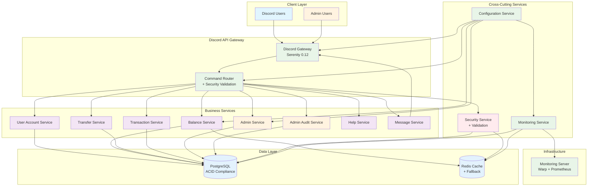

## Architecture Diagram

```mermaid
graph TB
    subgraph "Client Layer"
        D[Discord Users]
        A[Admin Users]
    end

    subgraph "Discord API Gateway"
        GW[Discord Gateway<br/>Serenity 0.12]
        CR[Command Router<br/>+ Security Validation]
    end

    subgraph "Business Services"
        UAS[User Account Service]
        BS[Balance Service]
        TS[Transfer Service]
        TXS[Transaction Service]
        AS[Admin Service]
        AAS[Admin Audit Service]
        HS[Help Service]
        MS[Message Service]
    end

    subgraph "Cross-Cutting Services"
        SS[Security Service<br/>+ Validation]
        CS[Configuration Service]
        MNS[Monitoring Service]
    end

    subgraph "Data Layer"
        DB[(PostgreSQL<br/>ACID Compliance)]
        CACHE[(Redis Cache<br/>+ Fallback)]
    end

    subgraph "Infrastructure"
        MON[Monitoring Server<br/>Warp + Prometheus]
    end

    D --> GW
    A --> GW
    GW --> CR
    CR --> UAS
    CR --> BS
    CR --> TS
    CR --> TXS
    CR --> AS
    CR --> HS
    CR --> AAS
    CR --> MS
    CR --> SS

    UAS --> DB
    BS --> DB
    BS --> CACHE
    TS --> DB
    TXS --> DB
    AS --> DB
    AAS --> DB
    SS --> DB
    SS --> CACHE

    MS --> GW
    MNS --> DB
    MNS --> CACHE
    MNS --> MON

    CS --> GW
    CS --> CR
    CS --> BS
    CS --> AS
    CS --> MNS

    style D fill:#e1f5fe
    style A fill:#fff3e0
    style GW fill:#e8f5e8
    style CR fill:#e8f5e8
    style UAS fill:#f3e5f5
    style BS fill:#f3e5f5
    style TS fill:#f3e5f5
    style TXS fill:#f3e5f5
    style AS fill:#fff3e0
    style AAS fill:#fff3e0
    style HS fill:#f3e5f5
    style MS fill:#f3e5f5
    style SS fill:#ffebee
    style CS fill:#e8f5e8
    style MNS fill:#e8f5e8
    style DB fill:#e3f2fd
    style CACHE fill:#e3f2fd
    style MON fill:#e8f5e8
```

*source_refs: ["docs/architecture/Architecture Diagram.md", "src/main.rs", "src/services/mod.rs"]*

