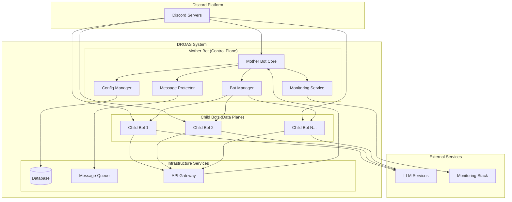

## System Architecture

```mermaid
graph TB
    subgraph "Discord Platform"
        D[Discord Servers]
    end
    
    subgraph "DROAS System"
        subgraph "Mother Bot (Control Plane)"
            MB[Mother Bot Core]
            CM[Config Manager]
            BM[Bot Manager]
            MP[Message Protector]
            MS[Monitoring Service]
        end
        
        subgraph "Child Bots (Data Plane)"
            CB1[Child Bot 1]
            CB2[Child Bot 2]
            CB3[Child Bot N...]
        end
        
        subgraph "Infrastructure Services"
            DB[(Database)]
            MQ[Message Queue]
            AG[API Gateway]
        end
    end
    
    subgraph "External Services"
        LLM[LLM Services]
        MON[Monitoring Stack]
    end
    
    D --> MB
    D --> CB1
    D --> CB2
    D --> CB3
    
    MB --> BM
    MB --> CM
    MB --> MP
    MB --> MS
    
    BM --> CB1
    BM --> CB2
    BM --> CB3
    
    CB1 --> AG
    CB2 --> AG
    CB3 --> AG
    
    AG --> MB
    
    CB1 --> LLM
    CB2 --> LLM
    CB3 --> LLM
    
    CM --> DB
    MS --> MON
    MP --> MQ
```

