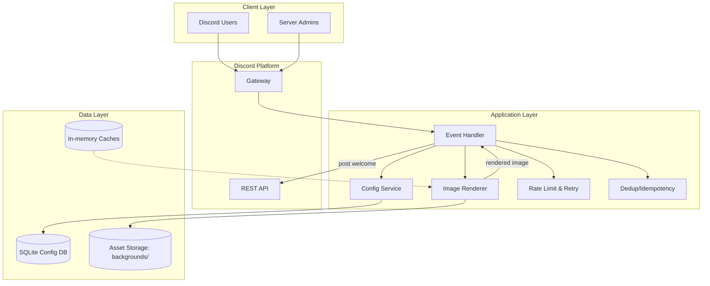

## System architecture

### Architecture diagram

```mermaid
graph TB
  subgraph "Client Layer"
    U[Discord Users]
    A[Server Admins]
  end

  subgraph "Discord Platform"
    G[Gateway]
    R[REST API]
  end

  subgraph "Application Layer"
    H[Event Handler]
    I[Image Renderer]
    C[Config Service]
    L[Rate Limit & Retry]
    D[Dedup/Idempotency]
  end

  subgraph "Data Layer"
    S[(SQLite Config DB)]
    F[(Asset Storage: backgrounds/)]
    M[(In-memory Caches)]
  end

  U --> G
  A --> G
  G --> H
  H --> C
  H --> I
  H --> L
  H --> D
  C --> S
  I --> F
  H -->|post welcome| R
  I -->|rendered image| H
  M -.-> I
```

