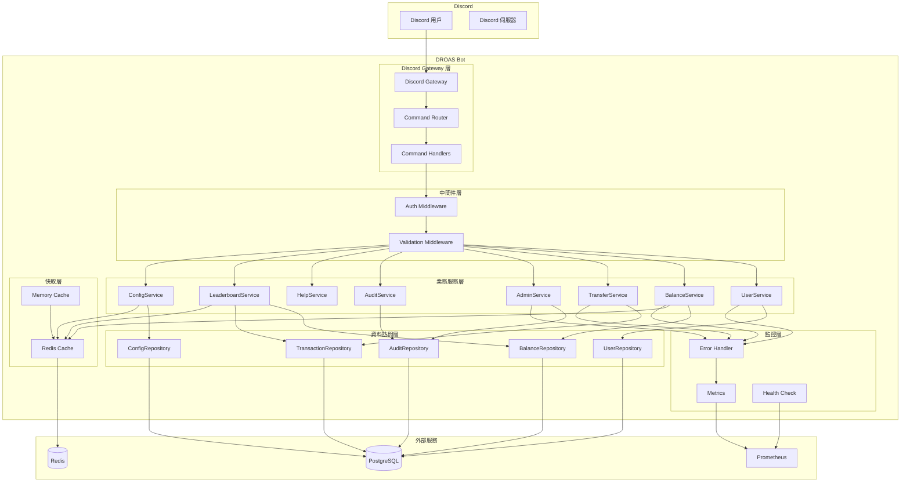

## 架構圖

```mermaid
graph TB
    subgraph "Discord"
        D1[Discord 用戶]
        D2[Discord 伺服器]
    end

    subgraph "DROAS Bot"
        subgraph "Discord Gateway 層"
            DG[Discord Gateway]
            CR[Command Router]
            CM[Command Handlers]
        end

        subgraph "中間件層"
            AM[Auth Middleware]
            VM[Validation Middleware]
        end

        subgraph "業務服務層"
            US[UserService]
            BS[BalanceService]
            TS[TransferService]
            AS[AdminService]
            AuS[AuditService]
            HS[HelpService]
            LS[LeaderboardService]
            CS[ConfigService]
        end

        subgraph "資料訪問層"
            UR[UserRepository]
            BR[BalanceRepository]
            TR[TransactionRepository]
            AR[AuditRepository]
            CCR[ConfigRepository]
        end

        subgraph "快取層"
            RC[Redis Cache]
            MC[Memory Cache]
        end

        subgraph "監控層"
            MT[Metrics]
            HC[Health Check]
            EH[Error Handler]
        end
    end

    subgraph "外部服務"
        PG[(PostgreSQL)]
        RD[(Redis)]
        PROM[Prometheus]
    end

    D1 --> DG
    DG --> CR
    CR --> CM
    CM --> AM
    AM --> VM
    VM --> US
    VM --> BS
    VM --> TS
    VM --> AS
    VM --> AuS
    VM --> HS
    VM --> LS
    VM --> CS

    US --> UR
    BS --> BR
    TS --> TR
    AS --> AR
    AuS --> AR
    LS --> BR
    LS --> TR
    CS --> CCR

    UR --> PG
    BR --> PG
    TR --> PG
    AR --> PG
    CCR --> PG

    BS --> RC
    LS --> RC
    CS --> RC

    RC --> RD
    MC --> RC

    US --> EH
    BS --> EH
    TS --> EH
    AS --> EH

    EH --> MT
    MT --> PROM
    HC --> PROM
```

