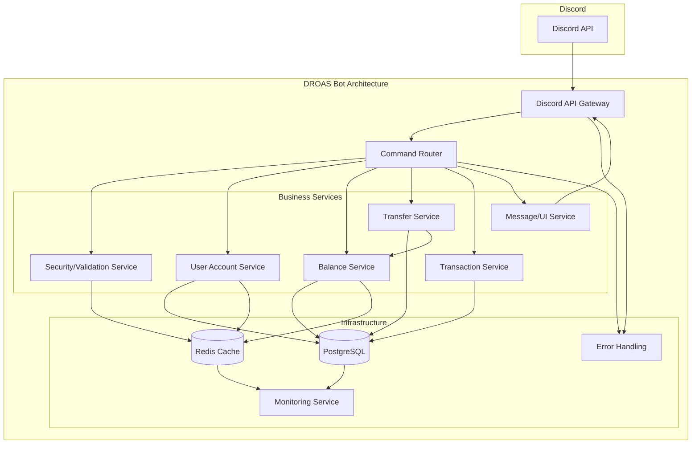

## 架構圖表

```mermaid
graph TB
  subgraph "Discord"
    D[Discord API]
  end

  subgraph "DROAS Bot Architecture"
    G[Discord API Gateway]
    CR[Command Router]

    subgraph "Business Services"
      UAS[User Account Service]
      BS[Balance Service]
      TS[Transfer Service]
      TXS[Transaction Service]
      MS[Message/UI Service]
      SS[Security/Validation Service]
    end

    subgraph "Infrastructure"
      DB[(PostgreSQL)]
      CACHE[(Redis Cache)]
      MON[Monitoring Service]
      EH[Error Handling]
    end
  end

  D --> G
  G --> CR
  CR --> SS
  CR --> UAS
  CR --> BS
  CR --> TS
  CR --> TXS
  CR --> MS

  UAS --> DB
  UAS --> CACHE
  BS --> DB
  BS --> CACHE
  TS --> DB
  TS --> BS
  TXS --> DB
  SS --> CACHE
  MS --> G

  DB --> MON
  CACHE --> MON
  G --> EH
  CR --> EH
```

