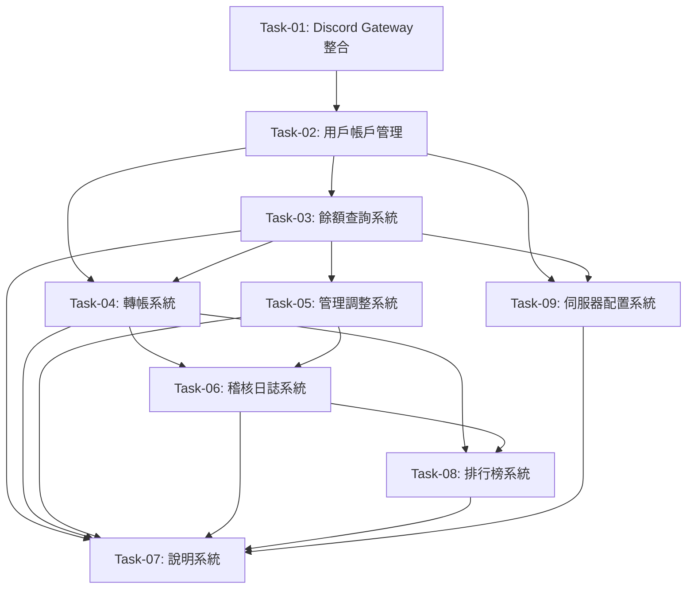

# DROAS Discord Economy Bot - 任務列表

## 專案概覽

建立一個以 Discord Slash Command 操作的伺服器內貨幣系統，支援查詢、轉帳、管理調整、稽核與指令說明，另含排行榜。貨幣在每個 Discord 伺服器各自獨立計算，僅支援繁體中文。

**版本**: v1.0.0
**創建日期**: 2025-10-09
**總任務數**: 9
**已完成任務數**: 0

## 任務列表

### 階段1：基礎設施

- [ ] **Task-01**
  - 實現Discord Gateway整合
  - **需求映射**: 無（基礎設施）
  - **架構組件**: Discord Gateway整合層
  - **優先級**: 高
  - **驗收標準**:
    - 成功連接Discord API
    - 註冊所有Slash Commands
    - 處理交互事件
    - 監聽Discord事件

- [ ] **Task-02**
  - 實現用戶帳戶管理系統
  - **需求映射**: REQ-001, REQ-002
  - **架構組件**: UserService, UserRepository
  - **優先級**: 高
  - **驗收標準**:
    - 自動創建新用戶帳戶
    - 通過Discord ID和伺服器ID識別帳戶
    - 支援跨伺服器獨立帳戶
    - 初始餘額為0

### 階段2：核心功能

- [ ] **Task-03**
  - 實現餘額查詢系統
  - **需求映射**: REQ-003, REQ-004, REQ-005
  - **架構組件**: BalanceService, BalanceRepository
  - **優先級**: 高
  - **驗收標準**:
    - 查詢自己餘額（私密回應）
    - 查詢他人餘額（私密回應）
    - 格式化顯示（小數位、千分位、貨幣符號）
    - 依伺服器設定顯示

- [ ] **Task-04**
  - 實現轉帳系統
  - **需求映射**: REQ-006, REQ-007, REQ-008, REQ-009, REQ-010
  - **架構組件**: TransferService, TransactionRepository
  - **優先級**: 高
  - **驗收標準**:
    - 轉帳請求驗證（金額、收款人、餘額）
    - 原子性交易執行
    - 生成唯一交易編號
    - 發送轉帳通知給收款方
    - 私密回應轉帳結果

### 階段3：管理功能

- [ ] **Task-05**
  - 實現管理調整系統
  - **需求映射**: REQ-011, REQ-012, REQ-013
  - **架構組件**: AdminService, AuditRepository (與 Task-06 共享)
  - **優先級**: 高
  - **驗收標準**:
    - 管理者權限驗證
    - 執行餘額調整（add/remove/set）
    - 支援負數餘額
    - 記錄調整操作和理由
    - 生成交易編號

- [ ] **Task-06**
  - 實現稽核日誌系統
  - **需求映射**: REQ-014, REQ-015, REQ-016
  - **架構組件**: AuditService, AuditRepository (與 Task-05 共享)
  - **優先級**: 高
  - **驗收標準**:
    - 記錄所有交易（轉帳、調整）
    - 查詢最近50筆記錄
    - 按時間降序排列
    - 管理者權限控制
    - 完整交易信息記錄

### 階段4：輔助功能

- [ ] **Task-07**
  - 實現說明系統
  - **需求映射**: REQ-017, REQ-018
  - **架構組件**: HelpService
  - **優先級**: 中
  - **依賴**: Task-03, Task-04, Task-05, Task-06, Task-08, Task-09 (提供完整指令說明)
  - **驗收標準**:
    - 顯示通用指令說明
    - 顯示特定指令詳細說明
    - 包含參數說明和使用範例
    - 私密回應

- [ ] **Task-08**
  - 實現排行榜系統
  - **需求映射**: REQ-019, REQ-020, REQ-021
  - **架構組件**: LeaderboardService
  - **優先級**: 低
  - **驗收標準**:
    - 餘額排行榜（前10名）
    - 轉帳次數排行榜
    - 參數控制（metric, limit）
    - 同分時按最近活動時間排序
    - 格式化顯示

- [ ] **Task-09**
  - 實現伺服器配置系統
  - **需求映射**: REQ-022, REQ-023, REQ-024
  - **架構組件**: ConfigService, ServerConfigRepository
  - **優先級**: 中
  - **驗收標準**:
    - 設定貨幣符號
    - 設定貨幣名稱
    - 設定千分位顯示
    - 保存伺服器特定配置
    - 在相關回應中使用配置

## 任務依賴關係

## 里程碑

1. **MVP 基礎版本** (Task-01 到 Task-04)
   - 基本的用戶帳戶管理和轉帳功能
   - 可以進行基本的貨幣操作

2. **管理功能版本** (Task-05 到 Task-06)
   - 完整的管理調整和稽核功能
   - 滿足管理員需求

3. **輔助功能版本** (Task-08, Task-09)
   - 排行榜和配置功能完成
   - 基本輔助功能

4. **完整功能版本** (Task-07)
   - 說明系統完成
   - 完整的用戶體驗

## 備註

- 所有任務都需考慮非功能需求（性能、安全性、可靠性）
- 每個任務完成后需要進行單元測試和集成測試
- 任務執行順序應遵循依賴關係
- 所有回應都必須是私密回應（僅用戶本人可見）
- 系統需支援繁體中文顯示